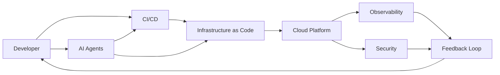

# 🚀 Platform Engineering Kit


<!-- DYNAMIC BADGE EXAMPLES (ENABLE LATER) -->

<!--


-->

> An opinionated platform engineering kit focused on automation, standardization and developer experience (DevEx), enabling scalable, secure and self-service cloud platforms.

---

## 📑 Table of Contents

- Overview
- Architecture
- Project Structure
- Core Capabilities
- AI Capabilities
- Developer Experience (DevEx)
- Governance & Standards
- Getting Started
- Value & Impact
- Philosophy
- Roadmap
- Contributing

---

## 🧭 Overview

This repository is a **Platform Engineering Kit** designed to act as a reusable foundation for:

- Environment provisioning
- Infrastructure standardization
- CI/CD automation
- Observability and security
- AI-driven workflows

---

## 🏗 Architecture



---

## 📁 Project Structure

> Modular, scalable and product-oriented structure

- docs → Documentation and decisions
- bootstrap → Environment initialization
- infrastructure → IaC definitions
- ci-cd → Pipelines and automation
- scripts → Utilities and helpers
- scripts/install/standalone → Independent application/runtime installers
- observability → Monitoring and logging
- security → Security and compliance
- templates → Reusable blueprints
- ai → Agents, prompts and workflows
- tools → Core platform tooling

---

## ⚙️ Core Capabilities

### 🚀 Platform Bootstrap

- Local and cloud environments
- Developer onboarding automation

### 🏗 Infrastructure as Code

- Terraform / Bicep modularization
- Multi-environment support

### 🔄 CI/CD Standardization

- Reusable pipelines
- Multi-platform support

### 📊 Observability

- Metrics, logs and alerting
- Production readiness

### 🔐 Security

- Secrets management
- Policy enforcement
- DevSecOps practices

---

## 🤖 AI Capabilities

- Infrastructure generation
- Pipeline automation
- Troubleshooting assistance
- Intelligent workflows

---

## 💡 Developer Experience (DevEx)

This repository is designed to:

- Reduce onboarding time
- Provide self-service capabilities
- Standardize workflows
- Minimize cognitive load

---

## 🏛 Governance & Standards

Defined under:

- docs/standards
- docs/decisions (ADR)

Includes:

- Naming conventions
- Pipeline standards
- Security policies
- Architecture guidelines

---

## 🚀 Getting Started

```bash
git clone https://github.com/your-username/platform-engineering-kit.git
cd platform-engineering-kit
```

Start with:

- bootstrap/local
- infrastructure/terraform
- ci-cd/templates

---

## 📊 Value & Impact

- Faster environment setup
- Reduced operational overhead
- Improved consistency
- Increased security posture
- Better developer productivity

---

## 🧠 Philosophy

> Treat your platform as a product

- Automation First
- Everything as Code
- DevEx Driven
- Secure by Design
- Observable by Default

---

## 🛣 Roadmap

- Terraform modules
- Kubernetes baseline
- CI/CD templates
- AI agents (DevOps assistant)
- Observability stack
- Internal Developer Platform (IDP)

---

## 🤝 Contributing

Follow:

- Standards in docs/standards
- ADR process in docs/decisions
- Keep documentation updated

---

## 📄 License

MIT
