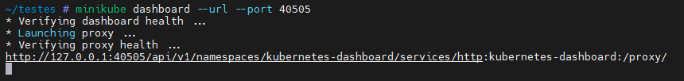
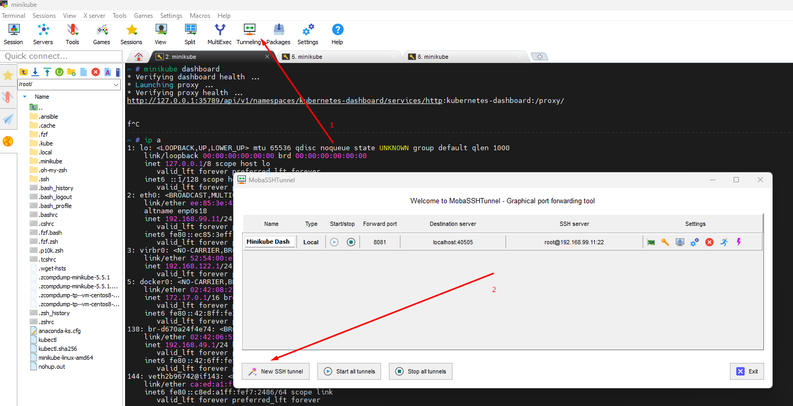
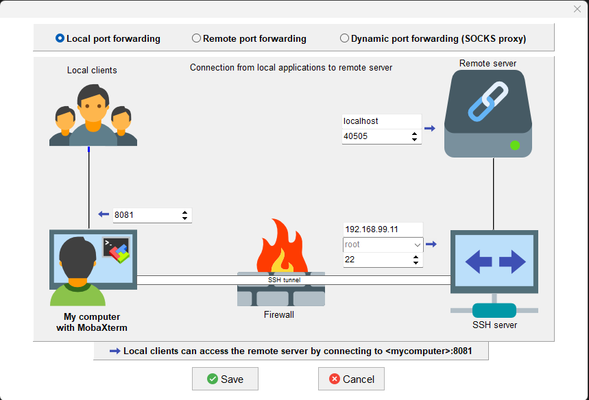
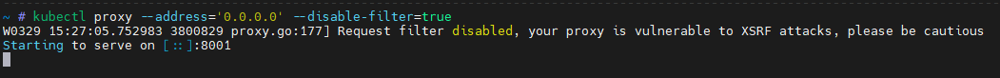

# **Minikube**

## **Instalação em centos8**

## **Utilização**

### **_docker driver_**

`minikube start --driver=docker --addons=metrics-server --addons=dashboard --addons=ingress --addons=ingress-dns --force`

### **_Acessar o Minikube com kubeconfig_**

Referência consultada:
https://faun.pub/accessing-a-remote-minikube-from-a-local-computer-fd6180dd66dd

Pontos relevantes para acesso remoto ao Minikube:

1. O endpoint do kube-apiserver do Minikube normalmente não é exposto para acesso externo direto.
2. Para acesso remoto, usar um proxy reverso (NGINX) em frente ao API server do cluster.
3. Proteger o proxy com autenticação básica (`auth_basic` + `.htpasswd`).
4. Encaminhar as requisições do proxy para `https://<minikube-ip>:8443`.
5. No cliente local, usar um kubeconfig dedicado para esse acesso remoto.

Fluxo recomendado:

1. Criar e subir o proxy NGINX no host remoto.
2. Validar acesso HTTP no proxy (porta publicada).
3. Criar kubeconfig local específico para o Minikube remoto.
4. Ajustar no kubeconfig o `server` para o endereço do proxy.
5. Testar com `kubectl --kubeconfig <arquivo> cluster-info` e `kubectl --kubeconfig <arquivo> get ns`.

Observação de segurança:

- Evitar credenciais em texto puro na URL do `server` do kubeconfig.
- Preferir TLS fim a fim e credenciais/certificados fora da URL quando possível.
- Restringir origem por IP no NGINX quando houver exposição pública.

script para nginx: https://github.com/RodrigoAPimentel/scripts/blob/main/external_access_minikube.sh

### **_Minikube dashboard_**

#### **Acessar de external host:**

1.  _SSH Tunnel:_

    ```
    http://localhost:8081/api/v1/namespaces/kubernetes-dashboard/services/http:kubernetes-dashboard:/proxy/
    ```

    - Executar o Comando: `minikube dashboard --url --port 40505` e deixar ele rodando
      
    - No Prompt de comando usar: `ssh -L <local host port>:localhost:<minikube dashboad port> <minikube host user>@<minikube host ip>` - Ex.: `ssh -L 8081:localhost:40505 root@192.168.99.11`
    - Criando o SSH Tunnel com MobaXterm:
      
      

2.  _kubectl proxy:_

    ```
    http://<minikube host ip>:8001/api/v1/namespaces/kube-system/services/kubernetes-dashboard/proxy/
    ```

    - Executar o Comando: `kubectl proxy --address='0.0.0.0' --disable-filter=true` e deixar ele rodando
      
      - Para CentOs ou sistemas que seja necessário abrir a porta 8001:
        ```
        sudo firewall-cmd --zone=public --add-port=8001/tcp --permanent
        sudo firewall-cmd --reload
        ```

    - Referência: https://stackoverflow.com/a/54960906
